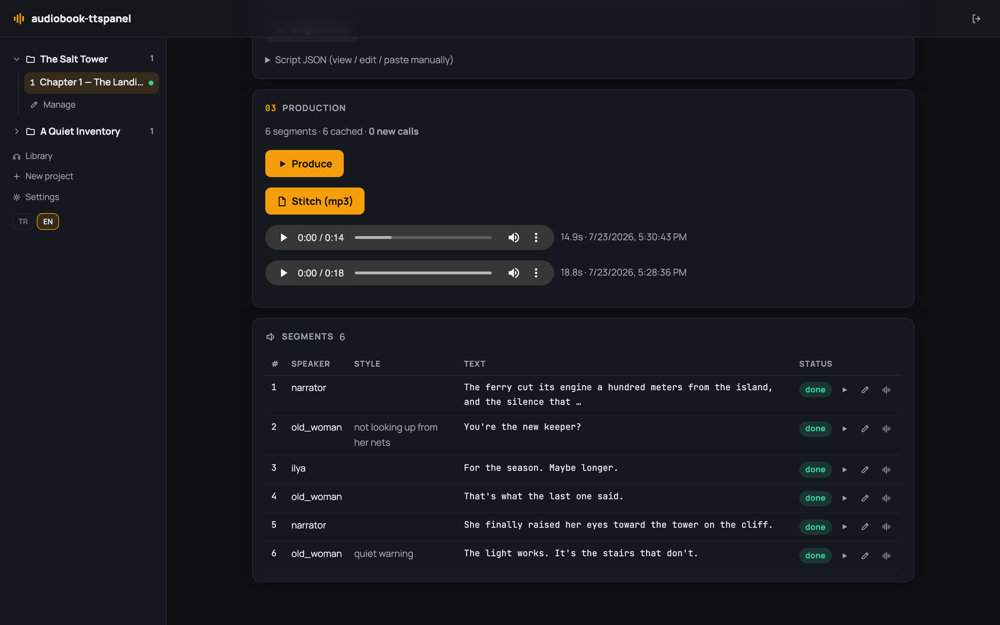
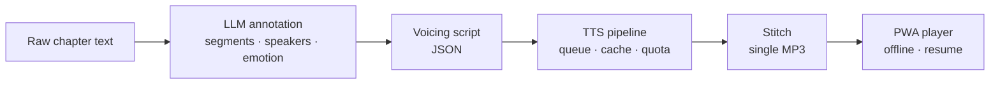
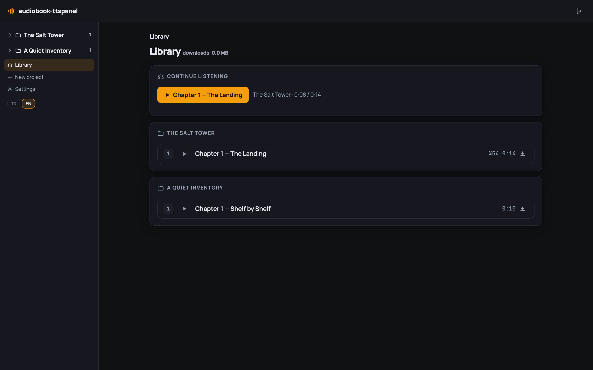

<div align="center">

# 🎧 audiobook-ttspanel

**Emotion-aware, multi-voice audiobook studio for web novels — self-hosted, bring your own key.**

[](LICENSE)
[](package.json)
[](https://nextjs.org)
[](tsconfig.json)
[](tests)
[](https://github.com/emree-sen/audiobook-ttspanel/pulls)

**English** | [Türkçe](README.tr.md)



</div>

Paste a chapter of raw text; get back a finished, listenable audiobook chapter. An LLM
splits the text into segments, tags each with speaker and emotion, and assigns voices —
then the TTS pipeline renders every segment, caches what hasn't changed, stitches the
result into a single MP3, and serves it to an installable PWA player on your phone.

Everything runs on your own machine or VPS: Next.js + SQLite + local disk. You bring
your own API keys (or run fully offline with a local TTS engine). Your texts and audio
never leave your server.

## How it works



The voicing script is a plain JSON contract — you can also write or edit it by hand.

## Features

**Studio**
- Project → chapter organization with a dark studio UI
- LLM annotation: raw text + narration style + voice mode (single narrator / multi-character) → structured voicing script; re-generate with extra instructions; per-character voice override
- Script and per-segment editing before or after rendering
- The panel UI speaks English and Turkish (auto-detected, switchable in Settings).

**Production pipeline**
- DB-backed job queue — survives browser close and server restarts; pause/resume
- Preflight call estimate + daily quota ledger before you spend a single API call
- Content-hash cache: unchanged segments are never re-rendered
- Per-segment listen & re-render; duration guard auto-retries absurd TTS output
- Separate stitch step: segments become one MP3 only when you say so

**Providers** (switchable, per-provider voice pools)
- **Gemini TTS** — emotion/style prompts, the most natural output
- **Any OpenAI-compatible server** — OpenAI TTS, AllTalk, openedai-speech, LocalAI…
- **Piper** — free, local, CPU-only; fully offline
- **Mock** — zero-cost dry runs of the whole pipeline

**Listening (PWA)**
- Library with "continue listening", per-series chapter lists, download & delete
- Offline playback with working seek; resume position stored server-side
- Global player bar: 0.75–2× speed, ±15/30 s skips, auto-next chapter, lock-screen controls (MediaSession)

<div align="center">

</div>

## Quick start

Requires Node ≥ 20.

```bash
git clone https://github.com/emree-sen/audiobook-ttspanel.git
cd audiobook-ttspanel
npm install
cp .env.example .env   # set GEMINI_API_KEY and PANEL_PASSWORD
npm run dev            # http://localhost:3000
```

> **Warning:** with an empty `PANEL_PASSWORD` the panel is open without auth — local
> development only. Set it before exposing the panel to the internet.

Try it for free without any API key: set `TTS_PROVIDER=mock` and `LLM_PROVIDER=mock`
in `.env` — the whole pipeline runs with silent placeholder audio.

For production: `npm run build && npm start` (also required for PWA/offline features).

## Fully local setup (no API keys)

Run both the annotation LLM and TTS on your own machine — nothing leaves it.

1. **LLM — LM Studio** (or Ollama, or any OpenAI-compatible server):
   load a model (e.g. `openai/gpt-oss-20b`) and start the local server
   (LM Studio serves at `http://localhost:1234/v1`).
   In **Settings → LLM (annotation)**, pick *OpenAI-compatible*, set the address and model name.
   Preset buttons for LM Studio/Ollama fill the address for you; "Test connection" verifies it.
2. **TTS — XTTS-v2** (natural, voice cloning, Turkish support):
   see [`tools/xtts-server/`](tools/xtts-server/README.md) — `./run.sh --lang tr`
   sets everything up on first run, or press **Start** on the XTTS server card in
   Settings. Then add the connection with the **Add XTTS server** preset button
   (or manually: address `http://localhost:8020/v1`, any model name) and voices
   named after your reference WAV files. You can upload reference voices from the
   panel (Settings → XTTS server → Reference voices) — no filesystem access needed.
   *Lighter alternative:* [Piper](https://github.com/OHF-Voice/piper1-gpl) is built in —
   fast even on CPU, at the cost of a flatter voice.

   The *Quick setup* card at the top of Settings shows the status of all three steps
   (LLM, TTS, voice pool) and jumps to the right card.
3. Prefer cloud quality later? Just switch the provider back in Settings —
   local and API providers coexist.

License note: XTTS-v2 model weights use the Coqui CPML (non-commercial) license;
this repo stays MIT and does not ship the weights.

## TTS providers

| Provider | Cost | Emotion/style | Notes |
|---|---|---|---|
| **Gemini TTS** (default) | free tier ≈ 100 requests/day, then paid | ✅ | most natural; panel manages the daily quota (preflight, pause/resume) |
| **OpenAI-compatible** | depends on server | — | any `/v1/audio/speech` server; local or cloud |
| **Piper** | free | — | local CPU inference, fully offline |
| **Mock** | free | — | silent audio for testing the pipeline |

The active provider and all keys/connections are managed in **Settings** (bottom of the
sidebar). Keys can live in `.env` or the database (masked in the UI; DB wins).

**Gemini** — set `GEMINI_API_KEY` in `.env` or Settings. On the free tier the panel's
preflight + quota ledger keep you inside the ~100 requests/day limit; with billing
enabled raise the `quota_limit_gemini` setting.

**OpenAI-compatible servers** — Settings → "OpenAI-compatible connections" → name +
base URL (including `/v1`, e.g. `http://localhost:8000/v1`) + model + key if needed.
Fill the connection's voice pool manually or click "Add official OpenAI voices".
Works with [AllTalk](https://github.com/erew123/alltalk_tts),
[openedai-speech](https://github.com/matatonic/openedai-speech), LocalAI and friends —
the server must support `response_format: "wav"` (the common case).

**Piper** — download a [Piper release](https://github.com/OHF-Voice/piper1-gpl/releases),
grab voice models (`.onnx` + `.onnx.json` side by side — e.g. Turkish:
[tr_TR-fahrettin-medium](https://huggingface.co/rhasspy/piper-voices/tree/main/tr/tr_TR/fahrettin/medium)),
then point Settings → Piper at the executable and model files.

Only Gemini applies emotion/style directions; other providers read segments plainly
(the preflight line tells you when styles will be dropped).

## Usage

1. Create a project → chapter, paste the raw text, pick narration style and voice mode
   (single narrator / multi-character).
2. **"Generate script (LLM)"** — the text is segmented and tagged with emotion/style,
   characters get voices from the pool. Not happy? Add an instruction and regenerate,
   or change any character's voice from the list.
3. **"Produce"** — segment-by-segment TTS with live progress. Listen, fix individual
   segments (edit text → re-render just that segment), then **"Stitch"** into a single
   MP3 and listen in the browser or the PWA.

Advanced: you can also paste a hand-written JSON voicing script (schema:
[`docs/superpowers/specs/2026-07-13-webnovel-tts-design.md`](docs/superpowers/specs/2026-07-13-webnovel-tts-design.md) §6).

## Listening on your phone (PWA)

- **Install:** open the panel in Chrome → menu → "Add to Home screen". PWA requires
  **HTTPS or localhost**, and the service worker only registers in a production build
  (`npm run build && npm start`).
- **Library / resume:** the "Continue" card reopens your last chapter at the exact
  position; below it chapters are grouped by series.
- **Offline:** download a chapter and `/library` keeps working in airplane mode —
  downloaded chapters play, seeking included. Delete removes the file from the device.
- **Controls:** play/pause, ±15/30 s, persistent 0.75–2× speed, lock-screen/notification
  controls, auto-advance to the next chapter.
- **iOS:** background playback and lock-screen controls are limited by Apple's PWA
  support; Android is the primary target.

## Known limitations

- Gemini TTS free tier: **~100 requests/day per model.** The panel shows the call count
  before starting and pauses the job when the quota runs out; resume it the next day
  and the cache picks up right where it left off.
- LLM annotation defaults to `gemini-2.5-flash` (free-tier quota, separate from the TTS
  quota); override with `LLM_MODEL`.
- Audio is served as whole files to the in-panel `<audio>` element; seeking there can
  be limited (the PWA player's downloaded chapters seek fine).

## Data & self-hosting

Everything lives in `./data/` — `app.db` (SQLite) plus `audio/`. Backing up your entire
library means copying one folder. No external services, no telemetry.

Built with Next.js 15 · React 19 · TypeScript · Drizzle + SQLite · zod · ffmpeg · vitest.

## License

[MIT](LICENSE) © Emre ŞEN
