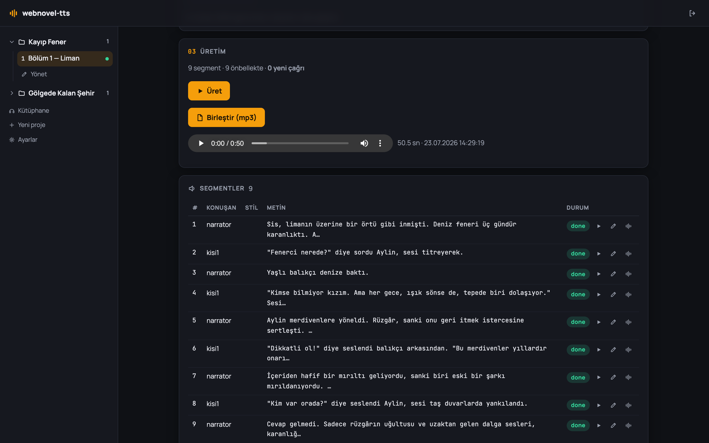
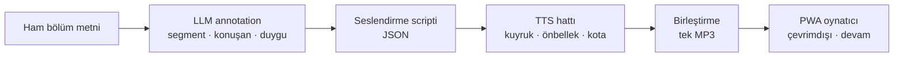
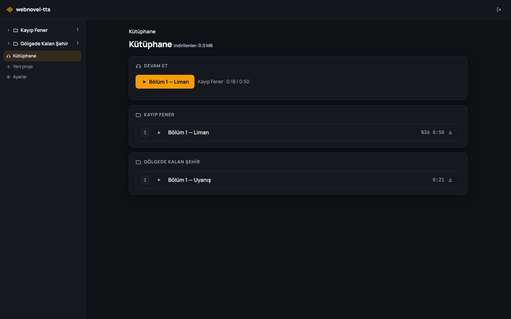

<div align="center">

# 🎧 audiobook-ttspanel

**Web novel'ler için duygu-duyarlı, çok-sesli sesli-kitap stüdyosu — kendi sunucunda, kendi anahtarınla.**

[](LICENSE)
[](package.json)
[](https://nextjs.org)
[](tsconfig.json)
[](tests)
[](https://github.com/emree-sen/audiobook-ttspanel/pulls)

[English](README.md) | **Türkçe**



</div>

Ham bölüm metnini yapıştır; karşılığında bitmiş, dinlenmeye hazır bir sesli-kitap bölümü
al. Bir LLM metni segmentlere ayırır, her segmenti konuşan ve duyguyla etiketler, sesleri
atar — ardından TTS hattı her segmenti seslendirir, değişmeyenleri önbellekten kullanır,
sonucu tek bir MP3'e birleştirir ve telefonuna kurulabilen PWA oynatıcıya sunar.

Her şey kendi makinende veya VPS'inde çalışır: Next.js + SQLite + yerel disk. API
anahtarlarını sen getirirsin (ya da lokal bir TTS motoruyla tamamen çevrimdışı
çalıştırırsın). Metinlerin ve seslerin sunucundan asla çıkmaz.

## Nasıl çalışır



Seslendirme scripti düz bir JSON sözleşmesidir — elle de yazabilir veya düzenleyebilirsin.

## Özellikler

**Stüdyo**
- Koyu stüdyo arayüzüyle proje → bölüm organizasyonu
- LLM annotation: ham metin + anlatım tarzı + ses modu (tek anlatıcı / çok karakterli) → yapılandırılmış seslendirme scripti; ek talimatla yeniden üretme; karakter bazında ses değiştirme
- Üretimden önce veya sonra script ve segment düzeyinde düzenleme

**Üretim hattı**
- DB-destekli iş kuyruğu — tarayıcı kapansa da, sunucu yeniden başlasa da sürer; duraklat/devam
- Tek bir API çağrısı harcamadan önce preflight çağrı hesabı + günlük kota defteri
- Content-hash önbelleği: değişmeyen segment asla yeniden seslendirilmez
- Segment başına dinleme ve yeniden üretme; süre bekçisi absürt TTS çıktısını otomatik yeniden dener
- Ayrı "Birleştir" adımı: segmentler ancak sen istediğinde tek MP3 olur

**Sağlayıcılar** (değiştirilebilir, sağlayıcı-bazlı ses havuzları)
- **Gemini TTS** — duygu/stil yönergeleri, en doğal çıktı
- **Her OpenAI-uyumlu sunucu** — OpenAI TTS, AllTalk, openedai-speech, LocalAI…
- **Piper** — ücretsiz, lokal, yalnız CPU; tamamen çevrimdışı
- **Mock** — tüm hattı sıfır maliyetle deneme

**Dinleme (PWA)**
- "Devam et" kartlı kütüphane, seriye göre bölüm listeleri, indir & sil
- Sarma dahil çevrimdışı oynatma; kaldığın yer sunucu tarafında saklanır
- Global oynatıcı çubuğu: 0.75–2× hız, ±15/30 sn atlama, otomatik sonraki bölüm, kilit ekranı kontrolleri (MediaSession)

<div align="center">

</div>

## Hızlı başlangıç

Gereksinim: Node ≥ 20.

```bash
git clone https://github.com/emree-sen/audiobook-ttspanel.git
cd audiobook-ttspanel
npm install
cp .env.example .env   # GEMINI_API_KEY ve PANEL_PASSWORD doldur
npm run dev            # http://localhost:3000
```

> **Uyarı:** `PANEL_PASSWORD` boşsa panel şifresiz açılır — yalnızca lokal geliştirme
> için. İnternete açmadan önce mutlaka doldur.

API anahtarı olmadan ücretsiz dene: `.env`'de `TTS_PROVIDER=mock` ve `LLM_PROVIDER=mock`
ayarla — tüm hat sessiz yer tutucu seslerle çalışır.

Üretim (production) için: `npm run build && npm start` (PWA/çevrimdışı özellikler için de şart).

## TTS sağlayıcıları

| Sağlayıcı | Maliyet | Duygu/stil | Notlar |
|---|---|---|---|
| **Gemini TTS** (varsayılan) | ücretsiz katman ≈ günde 100 istek, sonrası ücretli | ✅ | en doğal; günlük kotayı panel yönetir (preflight, duraklat/devam) |
| **OpenAI-uyumlu** | sunucuya bağlı | — | her `/v1/audio/speech` sunucusu; lokal veya bulut |
| **Piper** | ücretsiz | — | lokal CPU çıkarımı, tamamen çevrimdışı |
| **Mock** | ücretsiz | — | hattı test etmek için sessiz ses |

Aktif sağlayıcı ve tüm anahtarlar/bağlantılar **Ayarlar** ekranından yönetilir (sol
menünün altı). Anahtarlar `.env`'de veya veritabanında durabilir (arayüzde maskeli; DB öncelikli).

**Gemini** — `GEMINI_API_KEY` anahtarını `.env`'de veya Ayarlar'da gir. Ücretsiz katmanda
panelin preflight + kota defteri seni günde ~100 istek sınırının içinde tutar; faturalama
açıksa `quota_limit_gemini` ayarını yükselt.

**OpenAI-uyumlu sunucular** — Ayarlar → "OpenAI-uyumlu bağlantılar" → ad +
taban URL (`/v1` dahil, ör. `http://localhost:8000/v1`) + model + gerekiyorsa anahtar.
Bağlantının ses havuzunu elle doldur veya "Resmî OpenAI seslerini ekle"ye tıkla.
[AllTalk](https://github.com/erew123/alltalk_tts),
[openedai-speech](https://github.com/matatonic/openedai-speech), LocalAI ve benzerleriyle
çalışır — sunucunun `response_format: "wav"` desteklemesi gerekir (yaygın durum).

**Piper** — bir [Piper sürümü](https://github.com/OHF-Voice/piper1-gpl/releases) indir,
ses modellerini al (`.onnx` + `.onnx.json` yan yana — ör. Türkçe:
[tr_TR-fahrettin-medium](https://huggingface.co/rhasspy/piper-voices/tree/main/tr/tr_TR/fahrettin/medium)),
sonra Ayarlar → Piper'da çalıştırılabilir dosyayı ve model dosyalarını göster.

Duygu/stil yönergelerini yalnız Gemini uygular; diğer sağlayıcılar segmentleri düz okur
(stiller düşecekse preflight satırı bunu söyler).

## Kullanım

1. Proje → bölüm oluştur, ham metni yapıştır, anlatım tarzını ve ses modunu seç
   (tek anlatıcı / çok karakterli).
2. **"Script üret (LLM)"** — metin segmentlere ayrılır, duygu/stil etiketlenir,
   karakterlere havuzdan ses atanır. Beğenmedin mi? Ek talimat yazıp yeniden üret
   veya herhangi bir karakterin sesini listeden değiştir.
3. **"Üret"** — canlı ilerlemeyle segment segment TTS. Dinle, tek tek segmentleri
   düzelt (metni düzenle → yalnız o segmenti yeniden üret), sonra **"Birleştir"** ile
   tek MP3'e dönüştür ve tarayıcıda veya PWA'da dinle.

Gelişmiş: elle yazılmış bir JSON seslendirme scripti de yapıştırabilirsin (şema:
[`docs/superpowers/specs/2026-07-13-webnovel-tts-design.md`](docs/superpowers/specs/2026-07-13-webnovel-tts-design.md) §6).

## Telefonda dinleme (PWA)

- **Kurulum:** paneli Chrome'da aç → menü → "Ana ekrana ekle". PWA **HTTPS veya
  localhost** gerektirir; service worker yalnız production build'de kayıt olur
  (`npm run build && npm start`).
- **Kütüphane / devam:** "Devam et" kartı son dinlediğin bölümü tam kaldığın yerden
  açar; altında bölümler seriye göre gruplanmıştır.
- **Çevrimdışı:** bir bölümü indir, `/library` uçak modunda bile çalışmaya devam eder —
  indirilen bölümler çalar, sarma dahil. Sil, dosyayı cihazdan kaldırır.
- **Kontroller:** çal/duraklat, ±15/30 sn, kalıcı 0.75–2× hız, kilit ekranı/bildirim
  kontrolleri, sonraki bölüme otomatik geçiş.
- **iOS:** arka planda çalma ve kilit ekranı kontrolleri Apple'ın PWA desteğiyle
  sınırlı; birincil hedef Android.

## Bilinen kısıtlar

- Gemini TTS ücretsiz katmanı: **model başına günde ~100 istek.** Panel başlamadan önce
  çağrı sayısını gösterir, kota bitince işi duraklatır ve ertesi gün devam eder.
- LLM annotation varsayılanı `gemini-2.5-flash` (ücretsiz kota, TTS kotasından ayrı);
  `LLM_MODEL` ile değiştirilebilir.
- Panel arayüzü şimdilik yalnızca Türkçe (ürün Türkçe-öncelikli; hattın kendisi TTS
  sağlayıcının desteklediği her dille çalışır).
- Ses, panel içi `<audio>` elemanına tam dosya olarak servis edilir; orada sarma
  kısıtlı olabilir (PWA oynatıcının indirilen bölümlerinde sarma sorunsuz çalışır).

## Veri & self-hosting

Her şey `./data/` altında yaşar — `app.db` (SQLite) ve `audio/`. Tüm kütüphaneni
yedeklemek tek bir klasörü kopyalamak demek. Harici servis yok, telemetri yok.

Next.js 15 · React 19 · TypeScript · Drizzle + SQLite · zod · ffmpeg · vitest ile yazıldı.

## Lisans

[MIT](LICENSE) © Emre ŞEN
