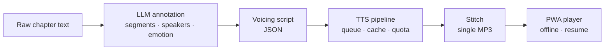

# Public Repo Cilası (README + LICENSE + CLAUDE.md) Uygulama Planı

> **For agentic workers:** REQUIRED SUB-SKILL: Use superpowers:subagent-driven-development (recommended) or superpowers:executing-plans to implement this plan task-by-task. Steps use checkbox (`- [ ]`) syntax for tracking.

**Goal:** Public repo için vitrin kalitesinde README.md (EN) + README.tr.md, MIT LICENSE, ekran görüntüleri ve kural-odaklı temiz CLAUDE.md üretmek.

**Architecture:** Yalnız doküman + görsel işi; kod değişikliği yok. Ekran görüntüleri mock sağlayıcılarla geçici DATA_DIR üzerinde çalışan dev sunucudan Playwright ile çekilir. README içeriği bu planda tam olarak verilmiştir; TR sürüm EN'in birebir çevirisidir.

**Tech Stack:** Markdown (GitHub-flavored, mermaid), shields.io statik rozetler, Playwright (npx, chromium), curl (seed).

**Spec:** `docs/superpowers/specs/2026-07-20-public-repo-readme-design.md`

---

### Task 1: LICENSE (MIT)

**Files:**
- Create: `LICENSE`

- [ ] **Step 1: LICENSE dosyasını yaz**

Tam içerik:

```
MIT License

Copyright (c) 2026 Emre ŞEN

Permission is hereby granted, free of charge, to any person obtaining a copy
of this software and associated documentation files (the "Software"), to deal
in the Software without restriction, including without limitation the rights
to use, copy, modify, merge, publish, distribute, sublicense, and/or sell
copies of the Software, and to permit persons to whom the Software is
furnished to do so, subject to the following conditions:

The above copyright notice and this permission notice shall be included in all
copies or substantial portions of the Software.

THE SOFTWARE IS PROVIDED "AS IS", WITHOUT WARRANTY OF ANY KIND, EXPRESS OR
IMPLIED, INCLUDING BUT NOT LIMITED TO THE WARRANTIES OF MERCHANTABILITY,
FITNESS FOR A PARTICULAR PURPOSE AND NONINFRINGEMENT. IN NO EVENT SHALL THE
AUTHORS OR COPYRIGHT HOLDERS BE LIABLE FOR ANY CLAIM, DAMAGES OR OTHER
LIABILITY, WHETHER IN AN ACTION OF CONTRACT, TORT OR OTHERWISE, ARISING FROM,
OUT OF OR IN CONNECTION WITH THE SOFTWARE OR THE USE OR OTHER DEALINGS IN THE
SOFTWARE.
```

- [ ] **Step 2: Commit**

```bash
git add LICENSE
git commit -m "chore: MIT lisansı ekle"
```

---

### Task 2: Ekran görüntüleri (mock sağlayıcı + Playwright)

**Files:**
- Create: `docs/screenshots/studio.png` (bölüm/üretim ekranı)
- Create: `docs/screenshots/library.png` (kütüphane + oynatıcı çubuğu)
- Geçici (commit edilmez): scratchpad altında `seed` çıktıları ve `shoot.mjs`

Bu task ortam engeline takılırsa (Playwright indirilemedi vb.) atlanır; Task 3'te görsel bloğu çıkarılır (spec'te öngörüldü). PNG'ler ~1440px genişlik, 2x ölçek, koyu tema (panelin tek teması).

- [ ] **Step 1: Geçici veri diziniyle mock sunucu başlat**

```bash
DATA_DIR=/private/tmp/claude-501/-Users-emre-dev-audiobook-ttspanel/59463275-513a-4d3e-9eda-fab2a401f506/scratchpad/shot-data \
TTS_PROVIDER=mock LLM_PROVIDER=mock PANEL_PASSWORD= \
npm run dev
```

(arka planda çalıştır; `http://localhost:3000` hazır olana dek bekle)

- [ ] **Step 2: Seed — API payload'larını doğrula, örnek içerik oluştur**

Önce şu dosyalardan gövde şemalarını oku (alan adları farklıysa curl'leri uyarlayın):
`app/api/projects/route.ts`, `app/api/projects/[id]/chapters/route.ts`, `app/api/chapters/[id]/annotate/route.ts`, `app/api/chapters/[id]/generate/route.ts`, `app/api/chapters/[id]/stitch/route.ts`.

Örnek (telifsiz, bu plan için yazılmış) metinle akış:

```bash
curl -sX POST localhost:3000/api/projects -H 'content-type: application/json' \
  -d '{"name":"Kayıp Fener"}'
curl -sX POST localhost:3000/api/projects/1/chapters -H 'content-type: application/json' \
  -d '{"title":"Bölüm 1 — Liman","rawText":"Sis, limanın üzerine bir örtü gibi inmişti. Deniz feneri üç gündür karanlıktı.\n\n— Fenerci nerede? diye sordu Aylin, sesi titreyerek.\n\nYaşlı balıkçı denize baktı. — Kimse bilmiyor kızım. Ama her gece, ışık sönse de, tepede biri dolaşıyor.\n\nAylin merdivenlere yöneldi. Rüzgâr, sanki onu geri itmek istercesine sertleşti."}'
curl -sX POST localhost:3000/api/chapters/1/annotate -H 'content-type: application/json' -d '{}'
curl -sX POST localhost:3000/api/chapters/1/generate -H 'content-type: application/json' -d '{}'
# generate kuyruk işiyse progress bitene kadar bekle, sonra:
curl -sX POST localhost:3000/api/chapters/1/stitch
```

Amaç: studio ekranında dolu segment listesi + üretim durumu, library'de "Devam et" kartı ve seri listesi görünmesi. Library "devam et" için bölümü tarayıcıda bir kez kısaca oynatmak gerekebilir (Playwright adımında yapılabilir).

- [ ] **Step 3: Playwright ile çek**

```bash
cd /private/tmp/claude-501/-Users-emre-dev-audiobook-ttspanel/59463275-513a-4d3e-9eda-fab2a401f506/scratchpad
npm init -y >/dev/null && npm i -D playwright >/dev/null
npx playwright install chromium
```

`shoot.mjs` (scratchpad'e yaz):

```js
import { chromium } from "playwright";
const OUT = "/Users/emre/dev/audiobook-ttspanel/docs/screenshots";
const browser = await chromium.launch();
const page = await browser.newPage({
  viewport: { width: 1440, height: 900 },
  deviceScaleFactor: 2,
});
for (const [path, name] of [
  ["/chapters/1", "studio.png"],
  ["/library", "library.png"],
]) {
  await page.goto("http://localhost:3000" + path, { waitUntil: "networkidle" });
  await page.waitForTimeout(500);
  await page.screenshot({ path: `${OUT}/${name}` });
}
await browser.close();
```

```bash
mkdir -p /Users/emre/dev/audiobook-ttspanel/docs/screenshots
node shoot.mjs
```

- [ ] **Step 4: Görsel kontrol**

İki PNG'yi Read ile aç, bak: boş ekran/hata yok, segmentler ve oynatıcı görünür. Sorunluysa seed'i düzeltip yeniden çek.

- [ ] **Step 5: Sunucuyu durdur, commit**

```bash
git add docs/screenshots/studio.png docs/screenshots/library.png
git commit -m "docs: README için panel ekran görüntüleri"
```

---

### Task 3: README.md (İngilizce, ana)

**Files:**
- Rewrite: `README.md`

- [ ] **Step 1: README.md'yi aşağıdaki tam içerikle değiştir**

(Task 2 atlandıysa `<p align="center"></p>` bloklarını çıkar.)

````markdown
<div align="center">

# 🎧 audiobook-ttspanel

**Emotion-aware, multi-voice audiobook studio for web novels — self-hosted, bring your own key.**

[](LICENSE)
[](package.json)
[](https://nextjs.org)
[](tsconfig.json)
[](tests)
[](https://github.com/emree-sen/audiobook-ttspanel/pulls)

**English** | [Türkçe](README.tr.md)


</div>

Paste a chapter of raw text; get back a finished, listenable audiobook chapter. An LLM
splits the text into segments, tags each with speaker and emotion, and assigns voices —
then the TTS pipeline renders every segment, caches what hasn't changed, stitches the
result into a single MP3, and serves it to an installable PWA player on your phone.

Everything runs on your own machine or VPS: Next.js + SQLite + local disk. You bring
your own API keys (or run fully offline with a local TTS engine). Your texts and audio
never leave your server.

## How it works



The voicing script is a plain JSON contract — you can also write or edit it by hand.

## Features

**Studio**
- Project → chapter organization with a dark studio UI
- LLM annotation: raw text + narration style + voice mode (single narrator / multi-character) → structured voicing script; re-generate with extra instructions; per-character voice override
- Script and per-segment editing before or after rendering

**Production pipeline**
- DB-backed job queue — survives browser close and server restarts; pause/resume
- Preflight call estimate + daily quota ledger before you spend a single API call
- Content-hash cache: unchanged segments are never re-rendered
- Per-segment listen & re-render; duration guard auto-retries absurd TTS output
- Separate stitch step: segments become one MP3 only when you say so

**Providers** (switchable, per-provider voice pools)
- **Gemini TTS** — emotion/style prompts, the most natural output
- **Any OpenAI-compatible server** — OpenAI TTS, AllTalk, openedai-speech, LocalAI…
- **Piper** — free, local, CPU-only; fully offline
- **Mock** — zero-cost dry runs of the whole pipeline

**Listening (PWA)**
- Library with "continue listening", per-series chapter lists, download & delete
- Offline playback with working seek; resume position stored server-side
- Global player bar: 0.75–2× speed, ±15/30 s skips, auto-next chapter, lock-screen controls (MediaSession)

<div align="center">

</div>

## Quick start

Requires Node ≥ 20.

```bash
git clone https://github.com/emree-sen/audiobook-ttspanel.git
cd audiobook-ttspanel
npm install
cp .env.example .env   # set GEMINI_API_KEY and PANEL_PASSWORD
npm run dev            # http://localhost:3000
```

> **Warning:** with an empty `PANEL_PASSWORD` the panel is open without auth — local
> development only. Set it before exposing the panel to the internet.

Try it for free without any API key: set `TTS_PROVIDER=mock` and `LLM_PROVIDER=mock`
in `.env` — the whole pipeline runs with silent placeholder audio.

For production: `npm run build && npm start` (also required for PWA/offline features).

## TTS providers

| Provider | Cost | Emotion/style | Notes |
|---|---|---|---|
| **Gemini TTS** (default) | free tier ≈ 100 requests/day, then paid | ✅ | most natural; panel manages the daily quota (preflight, pause/resume) |
| **OpenAI-compatible** | depends on server | — | any `/v1/audio/speech` server; local or cloud |
| **Piper** | free | — | local CPU inference, fully offline |
| **Mock** | free | — | silent audio for testing the pipeline |

The active provider and all keys/connections are managed in **Settings** (bottom of the
sidebar). Keys can live in `.env` or the database (masked in the UI; DB wins).

**Gemini** — set `GEMINI_API_KEY` in `.env` or Settings. On the free tier the panel's
preflight + quota ledger keep you inside the ~100 requests/day limit; with billing
enabled raise the `quota_limit_gemini` setting.

**OpenAI-compatible servers** — Settings → "OpenAI-compatible connections" → name +
base URL (including `/v1`, e.g. `http://localhost:8000/v1`) + model + key if needed.
Fill the connection's voice pool manually or click "Add official OpenAI voices".
Works with [AllTalk](https://github.com/erew123/alltalk_tts),
[openedai-speech](https://github.com/matatonic/openedai-speech), LocalAI and friends —
the server must support `response_format: "wav"` (the common case).

**Piper** — download a [Piper release](https://github.com/OHF-Voice/piper1-gpl/releases),
grab voice models (`.onnx` + `.onnx.json` side by side — e.g. Turkish:
[tr_TR-fahrettin-medium](https://huggingface.co/rhasspy/piper-voices/tree/main/tr/tr_TR/fahrettin/medium)),
then point Settings → Piper at the executable and model files.

Only Gemini applies emotion/style directions; other providers read segments plainly
(the preflight line tells you when styles will be dropped).

## Usage

1. Create a project → chapter, paste the raw text, pick narration style and voice mode
   (single narrator / multi-character).
2. **"Generate script (LLM)"** — the text is segmented and tagged with emotion/style,
   characters get voices from the pool. Not happy? Add an instruction and regenerate,
   or change any character's voice from the list.
3. **"Produce"** — segment-by-segment TTS with live progress. Listen, fix individual
   segments (edit text → re-render just that segment), then **"Stitch"** into a single
   MP3 and listen in the browser or the PWA.

Advanced: you can also paste a hand-written JSON voicing script (schema:
[`docs/superpowers/specs/2026-07-13-webnovel-tts-design.md`](docs/superpowers/specs/2026-07-13-webnovel-tts-design.md) §6).

## Listening on your phone (PWA)

- **Install:** open the panel in Chrome → menu → "Add to Home screen". PWA requires
  **HTTPS or localhost**, and the service worker only registers in a production build
  (`npm run build && npm start`).
- **Library / resume:** the "Continue" card reopens your last chapter at the exact
  position; below it chapters are grouped by series.
- **Offline:** download a chapter and `/library` keeps working in airplane mode —
  downloaded chapters play, seeking included. Delete removes the file from the device.
- **Controls:** play/pause, ±15/30 s, persistent 0.75–2× speed, lock-screen/notification
  controls, auto-advance to the next chapter.
- **iOS:** background playback and lock-screen controls are limited by Apple's PWA
  support; Android is the primary target.

## Known limitations

- Gemini TTS free tier: **~100 requests/day per model.** The panel shows the call count
  before starting, pauses the job when the quota runs out and resumes next day.
- LLM annotation defaults to `gemini-2.5-flash` (free-tier quota, separate from the TTS
  quota); override with `LLM_MODEL`.
- The panel UI is currently Turkish-only (the product is Turkish-first; the pipeline
  itself works with any language your TTS provider supports).
- Audio is served as whole files to the in-panel `<audio>` element; seeking there can
  be limited (the PWA player's downloaded chapters seek fine).

## Data & self-hosting

Everything lives in `./data/` — `app.db` (SQLite) plus `audio/`. Backing up your entire
library means copying one folder. No external services, no telemetry.

Built with Next.js 15 · React 19 · TypeScript · Drizzle + SQLite · zod · ffmpeg · vitest.

## License

[MIT](LICENSE) © Emre ŞEN
````

- [ ] **Step 2: Render ön-kontrolü**

Dosyayı VS Code markdown önizlemede aç (veya en azından şu kontrolleri yap): rozet URL'leri `https://img.shields.io/badge/...` biçiminde, mermaid bloğu ` ```mermaid ` ile açılıyor, tüm göreli linkler (`LICENSE`, `README.tr.md`, `docs/screenshots/*.png`, spec yolu) dosya sisteminde mevcut.

```bash
ls LICENSE README.tr.md docs/screenshots/studio.png docs/screenshots/library.png \
  docs/superpowers/specs/2026-07-13-webnovel-tts-design.md
```

(README.tr.md Task 4'te geleceği için bu komut Task 4'ten sonra tekrarlanır.)

- [ ] **Step 3: Commit**

```bash
git add README.md
git commit -m "docs: İngilizce vitrin README"
```

---

### Task 4: README.tr.md (Türkçe)

**Files:**
- Create: `README.tr.md`

- [ ] **Step 1: README.md'yi birebir Türkçeye çevirerek README.tr.md'yi yaz**

Yapı, sıra, rozetler, görseller, mermaid diyagramı ve tablolar Task 3'teki EN sürümle birebir aynı; yalnız metin Türkçe. Mevcut (eski) Türkçe README'deki ifadeler kaynak olarak kullanılabilir (`git show HEAD~:README.md`). Hero'daki dil satırı EN'in tersi olur:

```markdown
[English](README.md) | **Türkçe**
```

Slogan çevirisi: **"Web novel'ler için duygu-duyarlı, çok-sesli sesli-kitap stüdyosu — kendi sunucunda, kendi anahtarınla."** Mermaid düğüm etiketleri de çevrilir (Ham bölüm metni / LLM annotation / Seslendirme scripti / TTS hattı / Birleştirme / PWA oynatıcı).

- [ ] **Step 2: Link kontrolü (iki dosya için)**

```bash
ls LICENSE README.md README.tr.md docs/screenshots/studio.png docs/screenshots/library.png \
  docs/superpowers/specs/2026-07-13-webnovel-tts-design.md
```

Beklenen: hepsi listelenir, hata yok.

- [ ] **Step 3: Commit**

```bash
git add README.tr.md
git commit -m "docs: Türkçe README (README.tr.md)"
```

---

### Task 5: CLAUDE.md temizliği

**Files:**
- Rewrite: `CLAUDE.md`

- [ ] **Step 1: CLAUDE.md'yi aşağıdaki tam içerikle değiştir**

````markdown
# CLAUDE.md — Proje Rehberi

> Devralan her oturum (ve farklı cihaz) için tek kaynak. Burada kurallar, kararlar ve
> kritik kısıtlar durur; işin geçmişi `docs/superpowers/` spec/plan dosyaları ile git
> geçmişindedir.

## Proje nedir

Web novel'leri (ve kullanıcının kendi metinlerini) **duygu-duyarlı, çok-sesli**
seslendiren, üretim hattı panelli + PWA oynatıcılı, self-host bir **sesli-kitap üretim
& dinleme sistemi.** Akış: ham bölüm metni → panel içi LLM annotation → JSON
seslendirme scripti (segment + konuşan + duygu/stil + ses) → TTS + birleştirme →
dinleme. Elle JSON yapıştırma fallback (aynı şema sözleşme).

## Çalışma kuralları

- İletişim **Türkçe**. Kullanıcı: **"sor, kendin karar verme"** — tasarım/kapsam
  kararlarını tek taraflı alma; seçenekleri sun, o karar versin.
- Ucuz/pratik çözümler; astronomik API fiyatlarından kaçın; ücretsiz kotaları kullan.
- **README paritesi:** `README.md` (EN) ana, `README.tr.md` birebir çeviri. README
  içeriğine dokunan her iş İKİ dosyayı birden günceller.
- `scripts/` git-ignore'da (telifli kaynak metin içerebilir); bölüm scriptleri lokal
  kalır. Veri `./data/` (git-ignore).
- Repo public, BYO-key; lisans MIT.
- Prototip için tek anlatıcı ses yeterli (çoklu ses destekli; `--single-voice`).

## Temel kararlar

| Konu | Karar |
|---|---|
| Barındırma | **Self-host**: Next.js + SQLite (Drizzle) + yerel disk; tek-sahip auth (PANEL_PASSWORD) |
| Dil | Türkçe birincil, İngilizce ikincil |
| TTS motoru | **Gemini 3.1 Flash TTS Preview** (bake-off'ta seçildi; 2.5 robotik bulundu) |
| Adapter | Provider-agnostic (Gemini + OpenAI-uyumlu + Piper + Mock; Chirp/Azure/ElevenLabs eklenebilir) |
| İstemci | Responsive web + PWA (panel + oynatıcı tek kod) |
| Analiz akışı | raw_text → panel içi LLM annotation (provider-agnostic) → script; elle JSON da destekli |

## Durum

Plan ① (audio core + CLI) ve Dilim A→D + UI redesign tamam; panel uçtan uca çalışıyor.
Detaylar:

- Plan ①: `docs/superpowers/plans/2026-07-13-milestone-0-audio-core.md`
- Dilim A (panel iskeleti): `docs/superpowers/specs/2026-07-16-panel-slice-a-design.md`
- Dilim B (LLM annotation): `docs/superpowers/specs/2026-07-16-panel-slice-b-llm-annotation-design.md`
- UI redesign (koyu stüdyo): `docs/superpowers/specs/2026-07-17-panel-ui-redesign-design.md`
- Dilim C1 (üretim hattı): `docs/superpowers/specs/2026-07-17-panel-slice-c1-production-line-design.md`
- Dilim C2 (sağlayıcı ekosistemi): `docs/superpowers/specs/2026-07-17-panel-slice-c2-provider-ecosystem-design.md`
- Dilim C3 (üretim akışı): `docs/superpowers/specs/2026-07-18-panel-slice-c3-production-flow-design.md`
- Dilim D (kütüphane + PWA): `docs/superpowers/specs/2026-07-19-panel-slice-d-library-pwa-player-design.md`
- Public repo cilası (README/LICENSE): `docs/superpowers/specs/2026-07-20-public-repo-readme-design.md`

## Nasıl çalıştırılır

```bash
npm install
cp .env.example .env   # GEMINI_API_KEY + PANEL_PASSWORD
npm run dev            # http://localhost:3000  (ücretsiz test: TTS_PROVIDER=mock, LLM_PROVIDER=mock)
npm test               # vitest
```

CLI: `npx tsx src/cli/generate.ts <script.json> --out ./out --provider gemini|mock`
(`--single-voice gemini:Charon`, `--model …`). Doğrulanmış Gemini sesleri: Charon,
Algieba, Algenib, Leda, Schedar, Puck, Kore, Iapetus…

## Kritik kısıtlar

1. **Gemini TTS günlük kota (RPD):** free tier'da model başına **~100 istek/gün**
   (429: `generate_requests_per_model_per_day`). Prepay/Cloud kredisi bu limiti
   YÜKSELTMEZ; gerçek billing gerekir. Panel yönetiyor: preflight + kota defteri +
   duraklat/devam; hacim için faturasız alternatif Piper / OpenAI-uyumlu lokal.
   Faturalama açılırsa `quota_limit_gemini` ayarı yükseltilir. (Chirp 3 HD adapter'ı
   ileriye dönük seçenek.)
2. **Kırılgan stil prompt'ları:** bazı stiller modeli boş yanıta/uzun sessizliğe
   itebiliyor. Adapter'da stilli→düz fallback; panelde süre bekçisi (250 ms/karakter,
   min 4 sn, 1 yeniden deneme). Sürerse segment elle düzenlenip yeniden üretilir.
3. **Türkçe doğallık:** 3.1 ampirik kabul; adapter swappable, gerekirse Chirp/Azure.

## Belgeler

- Ana tasarım/spec: `docs/superpowers/specs/2026-07-13-webnovel-tts-design.md`
  (JSON script şeması §6)
- TTS araştırması: `docs/research/2026-07-13-tts-provider-research.md`
- Bake-off kararı: `docs/research/bakeoff-notes.md`

## Backlog (kullanıcıyla önceliklendir)

VPS kurulumu + HTTPS (PWA şartı), Gemini faturalama kararı / Chirp adapter'ı,
cache & renders GC, ses önizleme düğmesi, uyku zamanlayıcısı, PNG manifest ikonları
(eski Android), stitchLatest hata metni cilası.
````

- [ ] **Step 2: Bilgi kaybı kontrolü**

`git diff HEAD -- CLAUDE.md` çıktısındaki silinen satırları gözden geçir: spec/plan
dosyalarında ya da yeni metinde karşılığı olmayan kritik bilgi kalmamalı. (Bilinen
kasıtlı silmeler: dilim anlatım paragrafları, `C:/RN/` yol notu — cihaza bağlı olduğu
için çıkarıldı, kota bulgusunun uzun anlatımı — özet korunuyor.)

- [ ] **Step 3: Commit**

```bash
git add CLAUDE.md
git commit -m "docs: CLAUDE.md temizliği — kural odaklı, geçmiş spec linklerine indi"
```

---

### Task 6: Son doğrulama

- [ ] **Step 1: Test süiti hâlâ yeşil (kod değişmedi kanıtı)**

```bash
npm test
```

Beklenen: tümü PASS.

- [ ] **Step 2: Link + görsel bütünlüğü**

```bash
grep -oE '\]\(([^)#]+)' README.md README.tr.md | sed 's/.*(//' | grep -v '^http' | sort -u | xargs ls
```

Beklenen: her göreli yol listelenir, `ls` hatası yok.

- [ ] **Step 3: Kullanıcıya push onayı sor**

Push kullanıcı onayıyla: onaylarsa `git push`, ardından GitHub'da README (EN+TR) render kontrolü — rozetler, mermaid, görseller.
